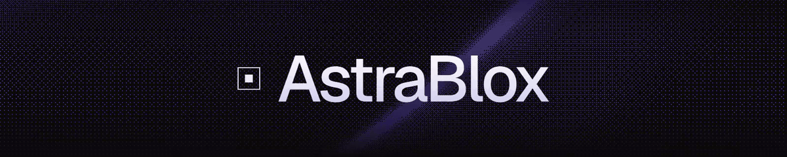
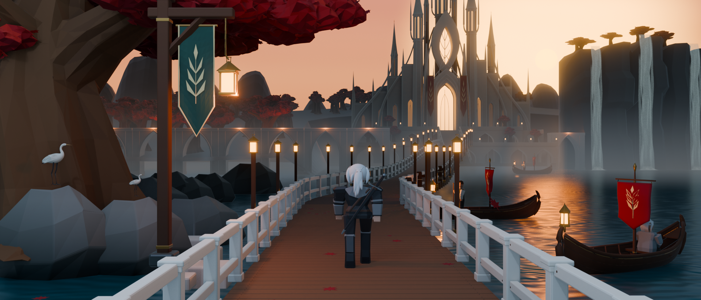

<p align="center"><a href="https://astrablox.app/"></a></p>

<p align="center">
  <strong>An autonomous AI game studio for Roblox. It designs, models, codes, plays and improves — around the clock.</strong>
</p>

<p align="center">
  <a href="https://astrablox.app/"></a>
  <a href="https://x.com/astrabl0x"></a>
  <a href="https://github.com/Astrablox/astrablox/releases/tag/v1.0.0"></a>
</p>

<p align="center">
  <a href="SETUP.md"></a>
  <a href="artifacts/README.md"></a>
  
  <a href="LICENSE"></a>
</p>

<p align="center">
  Write the vision once. Ten AI lanes take it from there: story and design, concept frames, Blender modelling, Luau gameplay, integration in Roblox Studio, playtesting, audio, interface, and a lane that improves the other lanes after every scene.
</p>

<p align="center">
  <br/>
  <sub>Built by the studio from one target frame: every piece modelled in Blender by the agent, no human in the scene.</sub>
</p>

---

## What is this?

AstraBlox is a studio, not a script. Long-lived Codex sessions, one per lane, work in the same checkout and talk to each other over `codex queue`. A lead owns the scene being built; the lanes own their craft. The studio generates its own target frames, models toward them in headless Blender, imports into Roblox Studio through its MCP server, plays the result with ordinary controls, and after every accepted scene a `dev` lane reads what happened and rewrites the lanes that fell short. Nothing waits for a human: the owner's voice lives in one file, `game/VISION.md`.

- **The picture comes first.** Every scene, piece and screen is built toward an image the studio generated and judged, then compared side by side after every build.
- **Blender for everything that is a mesh, Roblox for everything that behaves.** Kits, heroes, creatures, effects and interface art are modelled in Blender (through the session's Blender MCP or bpy scripts) and pass through the toolkit's gates: fixed-camera renders, baked materials, verified GLB, a layout for Studio; gameplay, AI, quests, lighting and audio live in Studio.
- **Proof, not reports.** A piece has a readiness state that resets when it changes; a scene is done when the Studio capture reads as the target frame and the route is completed by the player agent.
- **It improves itself.** The `dev` lane keeps a journal and a numbered problem inventory, fixes prompts, skills and tools after each scene, and a fresh audit judges every fix.

```
game/VISION.md ──► story + design (one scene ahead) ──► lead: target frames, exemplars
      ──► world · creatures · vfx · code · ui · audio (task cards on the board)
      ──► lead: assembly in Blender, side-by-side, numbered build
      ──► studio: import, lighting to the render, playtest, player completion, captures
      ──► scene accepted ──► dev: retro and fixes ──► next scene
```

---

## The lanes

Each lane is a Codex session started with `codex --session-name <lane>`; its craft is a TOML file in [`.codex/agents/`](.codex/agents/) and the skills it loads from [`.agents/skills/`](.agents/skills/). The lead's contract is [`AGENTS.md`](AGENTS.md); the names, formats and rules every lane shares are in [`docs/contract.md`](docs/contract.md).

| Lane | Owns |
|---|---|
| `lead` | The scene: plan, target frames, exemplars, assembly in Blender, builds, acceptance, dispatch. Builds pieces itself between dispatches. |
| `story` | Lore bible, scene plan, per-scene script: places, NPCs with schedules and lines, quests with choices and consequences, the scene contract. |
| `design` | Core loop and pillars, system specs, per-scene encounters and feel targets, tuning from playtests. |
| `world` | Kit pieces, hero structures, terrain, vegetation, Blender lighting matched to the target, verified GLB. |
| `creatures` | Player accessories and clothing, NPC and monster models, rigs, animations. |
| `vfx` | Cues from anticipation to dissipate: mesh effects, particles, camera work, hitstop, set-piece sequences, presentation code. |
| `code` | Controller, abilities, combat, enemy AI, quest logic, saves, remotes; luau gate and independent review. |
| `ui` | HUD, menus, prompts, dialogue and quest screens built to a generated mockup, checked at three viewports. |
| `audio` | Sound effects, ambiences, music and adaptive layers from open sources and local generation, through objective gates. |
| `studio` | Import, assembly to the Blender layout, Roblox lighting to the render, audio placement, playtest, player completion, captures, build export. |
| `dev` | After each scene: retro, fixes to lanes, skills and tools; a fresh audit of every change. |

---

## Quickstart

**1. Codex** — `npm install -g @openai/codex && codex login` (0.153 or newer; `codex queue` needs 0.149+).

**2. Blender 4.x** — install it; `python tools/blender/blender.py` finds it or set `BLENDER=<path>`.

**3. Roblox Studio** — open a published place, Assistant → Manage MCP Servers → Enable Studio as MCP server.

**4. The vision** — edit [`game/VISION.md`](game/VISION.md): what the game is, who it is for, the bar, what it must never do, what may leave the machine.

**5. Start the studio**

```powershell
.\scripts\run_studio.ps1          # opens one terminal per lane plus the supervisor
.\scripts\run_studio.ps1 -Stop    # writes STOP; every lane finishes its card and halts
```

The lead reads the vision, dispatches the first story and design cards, generates target frames and starts the first scene. Progress is visible in `board/STATE.md`, `game/scenes/<id>/card.md` and `builds/<n>/` (renders, side-by-sides, Studio captures, `CHANGES.md`). `codex agents` shows every session; `codex queue --session lead "..."` is how you talk to the lead while it runs.

Optional keys: `TRIPO_API_KEY` for image-to-3D form guides, `ROBLOX_API_KEY` for Open Cloud uploads, `OPENAI_API_KEY` only if your Codex session has no image-generation tool (target frames are generated with the session's own tool first). Without a key the corresponding tool prints what it would do and the lane reports the blocker.

---

## Tools

| Folder | What is in it |
|---|---|
| `tools/board/` | `board.py` (task cards, claims, reports, signals over `codex queue`), `supervisor.py` (wakes idle lanes, reopens stale tasks, STOP), `build_publish.py` (numbered builds with side-by-sides) |
| `tools/blender/` | headless launcher, fixed-camera renders, PBR baking, GLB export with re-import verification, layout export, side-by-side compositor |
| `tools/assets/` | Creator Store search, CC0 textures and skyboxes, concept image → Tripo mesh → optimise → Open Cloud upload → Studio insert, kit catalog |
| `tools/check/` | luau-lsp gate with Roblox types |
| `tools/audio/` | Creator Store audio search, objective audio gates |
| `tools/story/` | scene contract check |
| `tools/studio/` | static gate of the studio itself, run digest, session trajectory digest |
| `assets/library/` | catalogued CC0 kits (KayKit, Quaternius) with thumbnails |

---

## Project structure

```
astrablox/
├── AGENTS.md                 the lead's contract
├── docs/contract.md     shared names, formats and rules of every lane
├── .codex/agents/*.toml      one file per lane · .codex/config.toml registers them
├── .agents/skills/           blender-craft, concept-frames, narrative-witcher, ui-premium, audio-pipeline, roblox-*
├── game/                     VISION.md, DESIGN.md, LORE.md, PLAN.md, scenes/<id>/{card,script,contract,gameplay}.md
├── board/                    STATE.md, tasks/, reports/, heartbeats/, queue.log   (runtime, ignored)
├── builds/<n>/               renders, side-by-sides, captures, CHANGES.md          (runtime, ignored)
├── assets/                   per-lane assets with provenance; library/ is tracked
├── studio/                   journal.md, inventory.md, scenes/<id>/retro.md
├── tools/                    board, blender, assets, check, audio, story, studio
├── scripts/                  run_studio.ps1 / run_studio.sh, Stop hook, player harness
├── tests/                    fixtures for every tool
└── SETUP.md · RELEASE_NOTES.md · LICENSE
```

---

## Develop the studio

```powershell
python -B tools/studio/check_studio.py      # static gate: lanes, markers, skills, references
python -B tests/test_board_tools.py
python -B tests/test_studio_tools.py
python -B tests/test_audio_tools.py
python -B tests/test_story_tools.py
$env:BLENDER="C:\Program Files\Blender Foundation\Blender 4.2\blender.exe"; python -B tests/test_blender_tools.py
```

The gate must pass before a commit that touches `AGENTS.md`, `.codex/` or `.agents/`. Prefer letting the `dev` lane make changes to lanes: it reads the evidence first and a fresh instance audits the result. Full guide: [docs/DEVELOPMENT.md](docs/DEVELOPMENT.md).

---

## Where it stands

**Proven (v0.1.0).** One dated escape build was designed, built in parallel, reviewed, audited and completed five times by the player agent with ordinary controls. Full record: [artifacts/README.md](artifacts/README.md).

**v0.2.** Every role rewritten around its craft; art direction with a style kit; set pieces as clips; the studio-developer role and the reporting tools.

**v1.0.0.** The studio becomes autonomous: lanes as long-lived sessions on a file board with `codex queue` as the bus, target frames the studio generates itself, modelling in headless Blender, a design lane and a story lane built on CD Projekt Red's quest craft, a premium interface lane, an audio pipeline from open sources, and a dev lane that improves the rest after every scene. The scene above was built by the Blender pipeline from one target frame; the first full autonomous scene cycle on this version is still to be run, so its results are not claimed here. See [RELEASE_NOTES.md](RELEASE_NOTES.md).

---

## License

Framework code and documentation are released under the [MIT license](LICENSE). Referenced Roblox assets and CC0 kits keep their own licences; see `assets/library/INDEX.md`.

---

<h3 align="center">AstraBlox</h3>

<p align="center">Created by the AstraBlox dev team</p>

<p align="center">
  <a href="https://astrablox.app/"></a>
  <a href="https://x.com/astrabl0x"></a>
  <a href="https://github.com/Astrablox/astrablox/releases/tag/v1.0.0"></a>
</p>
