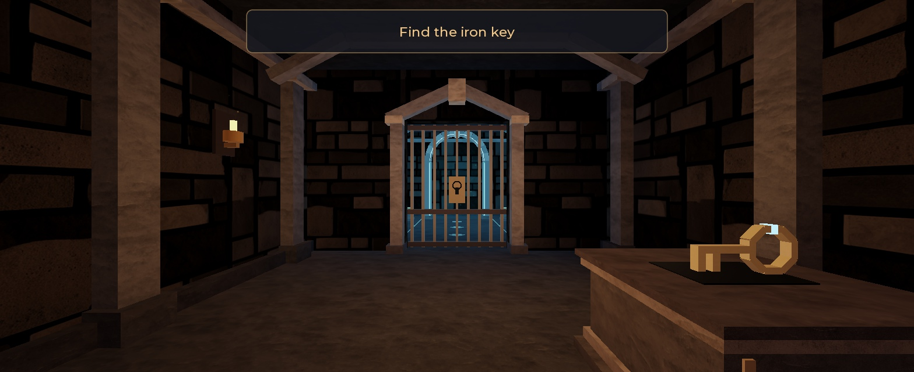
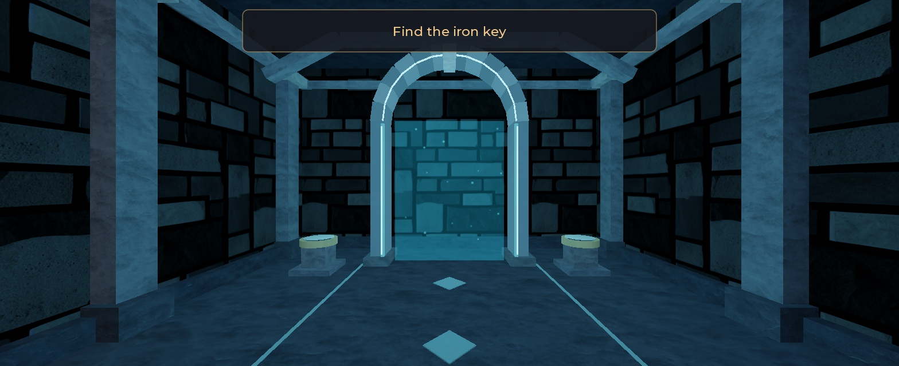
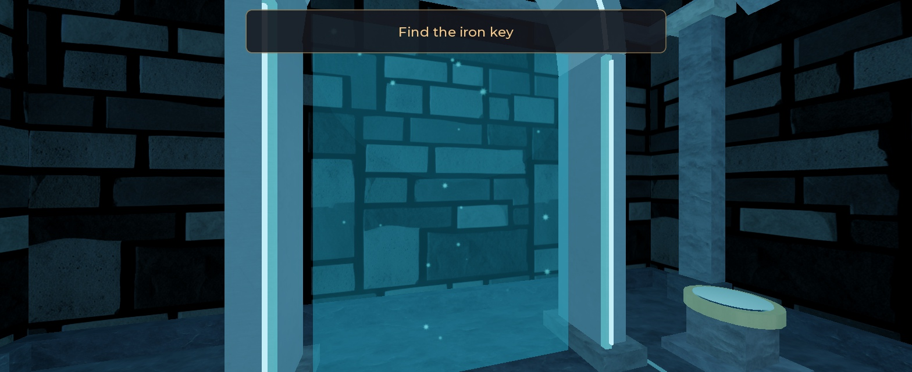

<p align="center"><a href="https://astrablox.app/"></a></p>

<p align="center">
  <strong>An AI game studio that lives inside Roblox Studio.</strong>
</p>

<p align="center">
  <a href="https://astrablox.app/"></a>
  <a href="https://x.com/astrabl0x"></a>
  <a href="https://github.com/Astrablox/astrablox/releases/tag/v0.1.1"></a>
</p>

<p align="center">
  <a href="SETUP.md"></a>
  <a href="artifacts/README.md"></a>
  
  <a href="LICENSE"></a>
</p>

<p align="center">
  Describe a game in one sentence. A team of AI agents designs it, builds it in your open Studio, plays it, fixes what breaks, and keeps going.
</p>

<p align="center">
  <a href="https://astrablox.app/"></a><br/>
  <sub><a href="https://astrablox.app/">astrablox.app</a> shows the studio working in real time: every task, its stage, elapsed time and captures.</sub>
</p>

---

## What is this?

AstraBlox turns one sentence into a Roblox experience built directly in your open Roblox Studio through its MCP server. It is not a template generator: a Game Master writes an architecture for your concept, hands the pieces to 18 specialist agents (architect, scripter, world-builder, lighting, sound, VFX, enemies, story, UI and more), checks what actually landed in Studio after every step, and does not call the job done until an independent reviewer and a player agent agree.

- **Real worlds, not cubes.** Generated 3D meshes and materials, Creator Store assets, terrain, hazards, layered audio, particles, cinematic lighting.
- **It can see.** Agents capture the viewport and judge a room the way a level designer would, then rebuild what fails.
- **It plays its own game.** A player agent finishes the level with ordinary controls, reads the error log, and sends bugs back as fixes.

```
You:       "Build a two-room escape: find the iron key, unlock the door, reach the shrine portal."

AstraBlox: architecture → scripts + world built in parallel → integration barrier
           → code review + art review + structural QA → player agent completes the route 5 times
           → saved, re-opened and hash-verified .rbxl with screenshots
```

No Luau, no 3D modelling and no Studio clicking on your side. You give the concept, the budget and the stop button.

---

## See it

The dungeon below is the reviewed foundation build `foundation-demo-v4-20260906T1256Z` (September 6, 2026): 190 parts, 3 scripts, two rooms, one key, one locked door, one portal. Every frame is a real Studio capture, not a render.

<table>
  <tr>
    <td width="33%"></td>
    <td width="33%"></td>
    <td width="33%"></td>
  </tr>
  <tr>
    <td align="center"><sub>Cell: wake up, find the key</sub></td>
    <td align="center"><sub>Shrine: the door opens on the other side</sub></td>
    <td align="center"><sub>Portal: the exit, refused until the door is unlocked</sub></td>
  </tr>
</table>

▶ **[Watch the player agent finish it (24 s, first person)](https://github.com/Astrablox/astrablox/releases/download/v0.1.0/AstraBlox-first-person-video.mp4)** — earned with ordinary keyboard input on the route above, no teleports or state grants. The clip is the social cut of a 12 FPS source recording packaged at 30 FPS; the raw capture is also attached to the [v0.1.0 release](https://github.com/Astrablox/astrablox/releases/tag/v0.1.0). Provenance, hashes and how to open the build yourself: [artifacts/README.md](artifacts/README.md).

---

## How it works

<table>
<tr><td width="56" align="center"><h3>💡</h3></td><td><strong>IDEA</strong><br/>You write the concept in plain language and give the run a budget: minutes and continuations. That is the whole brief.</td></tr>
<tr><td align="center">▼</td><td></td></tr>
<tr><td align="center"><h3>📐</h3></td><td><strong>PLAN</strong><br/>The producer (Game Master) turns it into a bounded task. The architect writes layout, ownership, interfaces, asset budget and acceptance scenarios before anything is built.</td></tr>
<tr><td align="center">▼</td><td></td></tr>
<tr><td align="center"><h3>👷</h3></td><td><strong>SPECIALISTS</strong><br/>Scripter and world-builder work in parallel on disjoint folders in Edit mode. Atmosphere, props, UI, narrative and threats join when the concept needs them.</td></tr>
<tr><td align="center">▼</td><td></td></tr>
<tr><td align="center"><h3>🎮</h3></td><td><strong>STUDIO</strong><br/>Everything is created in your live Roblox Studio through MCP. Instances, scripts, lighting and tags land in the real DataModel, and a read-only audit reports what is actually there.</td></tr>
<tr><td align="center">▼</td><td></td></tr>
<tr><td align="center"><h3>🔍</h3></td><td><strong>PROOF</strong><br/>An integration barrier, then independent code review, art review and structural QA. Finally one exclusive player agent has to complete the game with ordinary controls. Bugs go back as bounded fixes.</td></tr>
<tr><td align="center">▼</td><td></td></tr>
<tr><td align="center"><h3>📦</h3></td><td><strong>RESULT</strong><br/>An accepted build with a build ID, screenshots, a saved and re-verified place file, and a checkpoint that says exactly what passed and what is still open.</td></tr>
</table>

Under the hood: `scripts/run.ps1` starts one Codex session with a finite run record, a Stop hook may continue that same session while the counter and deadline allow, and `gamemaster/STOP` or `scripts/stop.ps1` ends it. Nothing restarts itself. The full producer contract is [AGENTS.md](AGENTS.md); the structure is in [docs/ARCHITECTURE.md](docs/ARCHITECTURE.md).

---

## What makes it different

- **Builds in your Studio, not in a sandbox.** Parts, scripts, lighting and tags appear in the open place through Roblox's own MCP server. You watch it happen.
- **Ownership instead of chaos.** Parallel builders get disjoint folders in Edit mode. Play, input, camera and shared atmosphere have exactly one owner at a time. Every interactable has one physical author and one runtime-state writer.
- **Proof, not promises.** Reports are cross-checked against the DataModel. "Started", "reported" and "verified" are different states. A screenshot is evidence of a scene, a completed player run is evidence of gameplay, and the docs keep that distinction.
- **A player that has to earn it.** The `computer-player` agent uses ordinary controls through a local input and capture harness with an explicit Studio lease. No teleports, no inventory grants, no camera writes.
- **Bounded by design.** Every run has a mode, an objective, a deadline and a continuation cap. A roadmap is a queue, not permission to build forever.
- **Everything is editable source.** Role prompts, the producer contract, the launcher and the tests are plain files in this checkout. Improve a role, run the fixtures, commit.

---

## Capabilities

| Area | What the framework does today |
|---|---|
| 🧭 Producer | PLAN / BUILD / PLAY / REVIEW modes, checkpoints in `gamemaster/`, inbox triage, blocked-state reporting, cooperative stop |
| 🏗️ Construction | Parts, modular assets, Terrain, generated meshes and materials, Creator Store references with recorded provenance |
| 💻 Scripts | Server-authoritative Luau with validated remotes, modern task APIs, `--!strict` for new code, independent security review |
| 🎨 Presentation | Lighting, audio, VFX, props, UI and narrative as assignable passes with frame-based acceptance |
| 🧪 Verification | Read-only Studio audit (`gamemaster/tools/audit.luau`), structural and behavioural QA, art-direction verdicts |
| 🕹️ Player evidence | Local window capture, bounded input under a lease, MP4 recording, regression and instrumented modes ([scripts/player/README.md](scripts/player/README.md)) |
| 📦 Delivery | Build IDs, `.rbxl` export with hash verification, showcase captures; upload and publish only when you authorise them |

---

## The 18 specialists

Roles are tools the producer picks from, not a mandatory pipeline. Each one is a small TOML profile in [`.codex/agents/`](.codex/agents/) with its responsibility, brief contract and the marker it must return.

<details open>
<summary><strong>📐 Plan and build</strong></summary>

| Role | Purpose |
|---|---|
| `roblox-architect` | Turns the concept into layout, ownership, interfaces, asset budget and acceptance scenarios |
| `luau-scripter` | Implements scripts, remotes, functional UI and runtime state in Studio |
| `world-builder` | Builds the static, tagged world; can own a full environment pass |
| `interior-designer` | Plans a complex room: identity, object manifest, story purpose |
| `detail-architect` | Adds infrastructure and substrate-appropriate detail |
| `set-dresser` | Places props and focal assets from the environment brief |

</details>

<details>
<summary><strong>🎨 Atmosphere and presentation</strong></summary>

| Role | Purpose |
|---|---|
| `lighting-director` | Designs lighting; can own audio and VFX as the single atmosphere owner |
| `sound-designer` | Ambient and spatial mix with load and listening evidence |
| `vfx-designer` | Environmental particles and beams with measured readability and cost |
| `ui-designer` | Readable desktop and touch UI states; new code goes to review |
| `story-teller` | Concise narrative beats and their in-game display |
| `enemy-designer` | Specified threats, AI and patrols, built before the first playable test |

</details>

<details>
<summary><strong>🔍 Independent acceptance</strong></summary>

| Role | Purpose |
|---|---|
| `luau-reviewer` | Final read-only review of all executable code: security, lifecycle, integration, performance |
| `art-director` | Player-view composition verdict: ALL CLEAN or NEEDS DIRECTION |
| `roblox-playtester` | Architecture-driven static and behavioural QA under an exclusive runtime lease |
| `computer-player` | Live player acceptance with ordinary input; visual, instrumented or regression mode |

</details>

<details>
<summary><strong>📦 Delivery</strong></summary>

| Role | Purpose |
|---|---|
| `showcase-photographer` | Labelled captures of the accepted build with its build ID |
| `roblox-publisher` | Export, upload and publish only an explicitly authorised build; reports each state separately |

</details>

---

## Quickstart

Three things, then you talk to it.

**1. Codex**

```powershell
npm install -g @openai/codex
codex login
```

Any ChatGPT subscription works. Pro gives the agents room for a full build.

**2. Roblox Studio**

Open a place in Roblox Studio (a published one). In the Assistant panel: `…` → **Manage MCP Servers** → **Enable Studio as MCP server**. That is the whole connection.

**3. Open the studio and describe your game**

```powershell
git clone https://github.com/Astrablox/astrablox.git
cd astrablox
codex
```

Say yes to trusting the folder, then type what you want:

```
Horror escape. 3 floors underground, keycards, flickering lights, a monster that hunts you.
```

The Game Master plans it, briefs the specialists, and the game appears in your open Studio while you watch. When it stops, say what to change or add next, or just: `keep going`.

### More things to say

```
Medieval dungeon crawler. 5 rooms, torches, a boss at the end, a key that opens the last gate.
```
```
Obby with 12 stages, moving platforms, lava, checkpoints. Bright and fast.
```
```
Cozy island tycoon. You start with a hut and grow a village.
```
```
Frozen mountain pass. Avalanches, rope bridges, one safe route up.
```
```
Zombie survival arena. Waves get harder every minute.
```
```
Play the game and fix everything you find.
```
```
Make the second room scarier. Less light, more sound.
```

The more mood and mechanics you give it, the better the game.

**Let it run without you.** `.\scripts\run.ps1 -Concept "..."` starts the same studio with a time budget and keeps it going on its own until the budget runs out or you run `.\scripts\stop.ps1`. Details in [SETUP.md](SETUP.md).

---

## Project structure

```
astrablox/
├── AGENTS.md                 producer contract: modes, leases, briefs, evidence, recovery
├── .codex/
│   ├── config.toml           Studio MCP wrapper + 18 role registrations (no credentials)
│   ├── hooks.json            Stop hook wiring
│   └── agents/*.toml         one profile per specialist
├── scripts/
│   ├── run.ps1 / stop.ps1    bounded launcher, resume, cooperative stop
│   ├── roblox-mcp.cmd        relative Studio MCP wrapper
│   ├── hooks/stop_continue.py
│   └── player/               local capture, bounded input, recording, tests and manual
├── gamemaster/tools/audit.luau   read-only Studio inventory and diagnostics
├── artifacts/                demo build: .rbxl, images, verification record, README
├── docs/                     architecture, development guide, example architecture and art contract
├── tests/                    isolated launcher and Stop-hook fixtures
├── SETUP.md · RELEASE_NOTES.md · LICENSE
```

Runtime state (concept, checkpoints, inbox, logs, reports) lives under an ignored `gamemaster/`; only `gamemaster/tools/` is source.

---

## Make it yours

The whole studio is editable text. Start here:

| To change | Edit |
|---|---|
| How the producer plans, delegates, leases Studio and accepts work | [AGENTS.md](AGENTS.md) |
| What a specialist does and must report | [.codex/agents/](.codex/agents/) |
| Run budgets, continuation and stopping | [scripts/run.ps1](scripts/run.ps1), [scripts/hooks/stop_continue.py](scripts/hooks/stop_continue.py) |
| Player observation, input and recording | [scripts/player/](scripts/player/) |
| What the Studio audit reports | [gamemaster/tools/audit.luau](gamemaster/tools/audit.luau) |

Verify before you commit:

```powershell
python -B tests/test_foundation_runtime.py
python -B -m unittest scripts.player.test_player scripts.player.test_regressions
```

The launcher suite runs against a fake Codex in isolated workspaces; the player suite mocks host input and needs Pillow and pywin32. Neither opens Studio or sends real input.

---

## Where it stands

**Proven (v0.1.0).** One dated escape build was designed, built in parallel, reviewed, audited and completed five times by the player agent with ordinary controls, reaching a 321-second server clock with zero new console errors. The exported `.rbxl` was saved, re-opened and matched by hash, tree and script sources. Full record: [artifacts/README.md](artifacts/README.md).

**Not yet claimed.** Other genres, blind visual discovery, reset and death handling, multiplayer and mobile, adversarial remotes, publication and ordinary-player joining each need their own build and evidence before they appear here as supported. Referenced Roblox assets keep their own permissions; see [referenced content](artifacts/README.md#referenced-roblox-content).

---

## License

Framework code and documentation are released under the [MIT license](LICENSE). Referenced Roblox assets are not covered by it and require their own permissions.

---

<h3 align="center">AstraBlox</h3>

<p align="center">Created by the AstraBlox dev team</p>

<p align="center">
  <a href="https://astrablox.app/"></a>
  <a href="https://x.com/astrabl0x"></a>
  <a href="https://github.com/Astrablox/astrablox/releases/tag/v0.1.0"></a>
</p>
